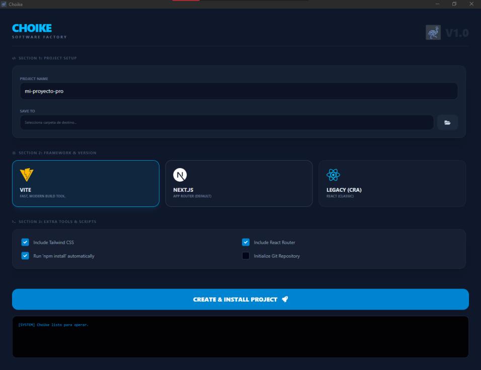

# 🚀 Choike V1.0


**Choike** es un launcher profesional diseñado para automatizar la creación de proyectos React en tiempo récord. Olvídate de escribir comandos repetitivos en la terminal; selecciona tu stack, elige la versión y lanza tu próxima gran idea.

---

## 📸 Vista Previa

<p align="center">
  
</p>

*Interfaz moderna y oscura optimizada para el flujo de trabajo de "Software Factory".*

---

## ✨ Características Principales

* **Framework Cards:** Interfaz intuitiva para seleccionar entre **Vite**, **Next.js** y **CRA**.
* **Smart Version Selector:** Dropdown dinámico que cambia las versiones disponibles según el framework elegido (Vite 4/5/6, Next 13/14/15).
* **Configuración de Setup:** Define el nombre y la carpeta de destino con un selector de directorios nativo.
* **Sección de Opciones Extra:**
    * Integración opcional de **Tailwind CSS**.
    * Configuración automática de **React Router**.
    * Auto-instalación de dependencias (`npm install`).
    * Inicialización de repositorios **Git**.
* **Terminal Log Integrada:** Monitoreo en tiempo real de la ejecución de comandos de terminal.

---

## 🛠️ Stack Tecnológico

Choike está construido con tecnologías modernas para garantizar velocidad y estabilidad:

* **Frontend:** React 19 + TypeScript.
* **Estilos:** Tailwind CSS.
* **Runtime:** Electron 34.
* **Build Tool:** Electron-Vite.

---

## 🚀 Cómo empezar

1. **Instalar dependencias:**
   ```bash
   npm install
   ```
2. **Ejecutar en modo desarrollo:**
   ```bash
   npm run dev
   ```
3. **Compilar para producción (Windows):**
   ```bash
   npm run ship
   ```

---

## 📂 Estructura del Proyecto

```text
├── src/
│   ├── main/          # Lógica de Electron (Main process)
│   ├── preload/       # Puente API (IPC Bridge)
│   └── renderer/      # Interfaz de usuario (React)
├── icon.ico           # Identidad visual
├── view.png           # Captura de pantalla de la app
└── package.json       # Configuración y scripts
```

---

## 👤 Autor

Desarrollado con ❤️ en Chile por **CoipoNorte**.
> "Un poquito del sure en el norte de Chile"

---

## 📄 Licencia

Este proyecto es de uso privado para CoipoNore, Usalo bajo tu responsabilidad.
